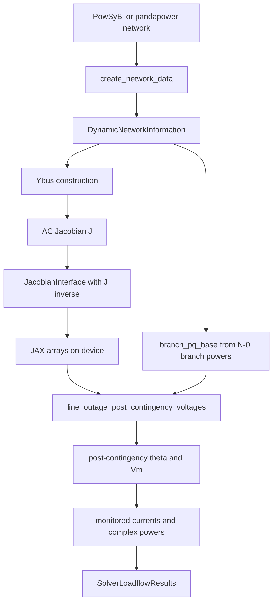

# DC+ Theory to Implementation Map

This document maps the paper
`Voltage-Sensitive Distribution Factors for Contingency Analysis and Topology Optimization`
(`2509.19976v2`) to the Python implementation in this repository.

The short version: the paper derives voltage-sensitive distribution factors by
linearizing the full AC power flow equations around a reference AC solution.
The code implements that idea as a hot-start, one-step AC approximation:

1. Import a solved N-0 network snapshot.
2. Build the AC power-flow Jacobian and its inverse once.
3. Represent branch outages or bus splits as low-rank Jacobian updates.
4. Use JAX to evaluate many independent contingencies in parallel.
5. Reconstruct monitored voltages, currents, and complex branch powers.

## Repository Architecture

The implementation is organized around three layers.

| Layer | Main files | Responsibility |
| --- | --- | --- |
| Network import | `src/dc_plus/importing/**`, `src/dc_plus/preprocess/create_network_data.py` | Convert PowSyBl or pandapower data into per-unit, array-oriented branch, bus, injection, and shunt data. |
| Linear AC model | `src/dc_plus/interfaces/jacobian_network_data.py`, `src/dc_plus/interfaces/jacobian_interface.py` | Build the hot-start AC Jacobian, invert it, and keep bookkeeping maps from buses to Jacobian rows. |
| Distribution-factor kernels | `src/dc_plus/jax/*.py`, `src/dc_plus/numpy/*.py` | Apply low-rank updates for line outages and bus splits. JAX is the accelerated path; NumPy is reference/testing support. |

The central data contracts are:

- `DynamicNetworkInformation`: numerical arrays for branch endpoints,
  admittances, N-0 voltages, branch flows, injections, shunts, and bus types.
- `StringNetworkInformation`: human-readable IDs kept off the accelerator path.
- `JacobianInterface`: the sparse Jacobian, dense inverse Jacobian, row masks,
  and bus-to-row index maps.
- `SolverLoadflowResults`: JAX output structure for N-1 monitored states and
  branch flows.

## Paper Equations and Code Mapping

### Branch AC equations, paper Eq. (1)

The paper starts from the full branch endpoint powers:

```text
p_f = v_f^2 g_ff + v_f v_t (g_ft cos(theta_ft) + b_ft sin(theta_ft))
q_f = -v_f^2 b_ff + v_f v_t (-b_ft cos(theta_ft) + g_ft sin(theta_ft))
```

The code stores the pi-model admittance terms as complex arrays:

- `y_ff`, `y_ft`, `y_tf`, `y_tt`
- `branch_from`, `branch_to`
- `v_mag_hat`, `theta_hat`

These arrays are created during network preprocessing in
`src/dc_plus/preprocess/create_network_data.py`, where branch admittance
components are collected into `DynamicNetworkInformation`.

### Linearized branch contribution, paper Eq. (2)

Paper Eq. (2) gives the local linearized relation between endpoint powers and
the local branch state `[theta_f, theta_t, u_f, u_t]`.

In code, the equivalent local derivative block is built by
`_compute_branch_delta_submatrix_from_admittance()` in
`src/dc_plus/jax/low_rank_helper.py` and mirrored in
`src/dc_plus/numpy/low_rank_helper.py`.

Important implementation detail: the paper defines
`v_i = v_hat_i (1 + u_i)`, so `u_i` is a normalized voltage deviation. The code
uses voltage magnitude `|V|` directly as the state variable. Therefore the code
derivatives are with respect to `V_m`, not normalized `u`. Conceptually:

```text
paper state: [theta, u]
code state:  [theta, |V|]
```

That is why the JAX helper names derivatives as `dpf_dvf`, `dqf_dvf`,
`dpt_dvt`, and similar. The mathematical role is the same, but the scaling is
absorbed into the Jacobian variable choice.

The JAX helper computes:

- angle derivatives, such as `dpf_dthf` and `dqf_dthf`
- voltage-magnitude derivatives, such as `dpf_dvf` and `dqf_dvf`
- the same four rows for the to-side endpoint
- a signed `4 x 4` delta block that can be inserted into a low-rank update

The affected Jacobian rows are always ordered as:

```text
[theta_from, theta_to, voltage_from, voltage_to]
```

Invalid entries, for example slack angle or non-PQ voltage magnitude rows, are
masked rather than removed. This keeps the JAX shapes static.

### Network equation, paper Eq. (6)

The paper writes the linearized network model as:

```text
[p, q]^T = [p_hat, q_hat]^T + M [theta, u]^T
```

In the code, `M` is the AC power-flow Jacobian:

- built by `get_jacobian_from_network_data()`
- wrapped by `_get_jacobian_data_from_network_data()`
- stored in `JacobianInterface.jacobian`
- inverted once into `JacobianInterface.inverse_jacobian`

The Jacobian is assembled from the sparse admittance matrix `Ybus`. The code
forms complex voltages, currents, `dS/dV`, and `dS/dtheta`, then slices the
standard Newton-Raphson blocks:

```text
J = [[dP/dtheta, dP/dVm],
     [dQ/dtheta, dQ/dVm]]
```

The row order follows power-flow convention:

```text
[P at PV/PQ buses, Q at PQ buses]
```

Slack-bus angle rows and PV-bus voltage-magnitude rows are omitted. The bus to
Jacobian-row mapping is stored as:

- `angle_component_indices`
- `magnitude_component_indices`
- `is_angle_component`
- `is_magnitude_component`

The mismatch helper `calculate_nodal_mismatch_network_data()` computes:

```text
S_calc - S_spec
```

and returns it in the same Jacobian row order.

### Branch modifications and Woodbury, paper Eqs. (7)-(10)

The paper represents topology changes as:

```text
M' = M + Delta M
```

and applies the Woodbury identity:

```text
(M + S R)^-1 = M^-1 - M^-1 S (I + R M^-1 S)^-1 R M^-1
```

The implementation uses the same structure, but for general branch outages it
uses a `4 x 4` local endpoint block rather than only the simplified `2 x 2`
ordinary-line factor from the paper's Eq. (13). This lets the code handle the
stored pi-model admittance terms `y_ff`, `y_ft`, `y_tf`, and `y_tt`.

The mapping is:

| Paper concept | Code representation |
| --- | --- |
| `M^-1` | `jacobian_inv_transposed`, stored transposed for faster row/column gathers |
| affected buses `f,t` | `branch_from[outage_idx]`, `branch_to[outage_idx]` |
| affected state rows | `_branch_state_indices()` |
| `Delta M` low-rank middle block | `d_mat` from `_prepare_low_rank_factors_from_admittance()` |
| `I + R M^-1 S` | `k_mat = eye(4) + d_masked @ a_sub` |
| Woodbury small solve | `jnp.linalg.solve(k_mat, rhs)` |
| masked missing state rows | `branch_valid_mask` and monitor masks |

This lives mainly in `src/dc_plus/jax/lodf_voltages.py`.

### Line outage solve, paper Eq. (9)

For a line outage, the removed branch no longer injects its N-0 endpoint powers.
The tests precompute `branch_pq_base` as:

```text
[P_from, P_to, Q_from, Q_to]
```

using the N-0 complex voltages and admittances. In
`_solve_outage_voltages()`, the per-outage seed is:

```python
mismatch_vec = -jnp.take(branch_pq_base, out_idx, axis=0)
```

Then `_compute_post_contingency_states()` applies the low-rank solve for one
outage:

1. Gather the branch endpoint Jacobian rows.
2. Build the local branch delta block `d_mat`.
3. Extract `a_sub`, the inverse-Jacobian submatrix on the affected rows.
4. Solve the small Woodbury correction system.
5. Project only monitored bus rows back to `theta` and `Vm`.
6. Add the state increments to the N-0 base values.

This produces:

```text
theta_post = theta_hat + Delta theta
Vm_post    = Vm_hat    + Delta Vm
```

The public voltage-only entry point is:

```python
line_outage_post_contingency_voltages(...)
```

The public monitored load-flow entry point is:

```python
line_outage_post_contingency_monitored(...)
```

### Branch currents and powers

After the post-contingency voltage state is computed, branch quantities are not
kept in a purely linearized flow form. The JAX branch module reconstructs
complex monitored-bus voltages:

```text
V = Vm * (cos(theta) + j sin(theta))
```

Then it applies the branch admittance equations:

```text
I_from = y_ff V_from + y_ft V_to
I_to   = y_tf V_from + y_tt V_to
S_from = V_from conj(I_from)
S_to   = V_to   conj(I_to)
```

That logic is in `src/dc_plus/jax/lodf_branches.py`. The outaged monitored
branch is explicitly set to zero.

### Bus splits and BSDF, paper Sec. V

The paper's bus split section uses padded intermediate topologies and low-rank
updates for opening a busbar coupler.

The implementation currently supports a practical subset:

- a pure branch re-attachment split
- a new placeholder bus prepared before the solve
- PQ-type new buses
- no shunt reassignment
- no branch parameter changes during the split
- no injection reassignment inside the JAX BSDF update

The preprocessing step is:

```python
preprocess_jacobian_bsdf(...)
```

It extends the Jacobian and inverse Jacobian with one angle and one
voltage-magnitude slot per allowed future split. Those padded slots are
initialized with identity blocks and placeholder bus data.

The JAX update is:

```python
compute_bsdf_update(...)
```

Internally it:

1. identifies branches moved from the original bus to the new bus,
2. computes old endpoint branch delta blocks,
3. computes new endpoint branch delta blocks,
4. accumulates `delta_old - delta_new` into one compact block,
5. adds diagonal constraints for the new placeholder state,
6. applies the same Woodbury-style inverse update as the LODF path.

The result is an updated inverse Jacobian transpose, which can then be used for
the one-step mismatch solve.

## JAX Acceleration Strategy

JAX is used for throughput, not for automatic differentiation in the hot path.
The derivatives are written explicitly from the power-flow equations.

The main acceleration choices are:

- `jax.numpy` arrays replace NumPy arrays in the performance kernels.
- `@jax.jit` compiles monitor-row setup and single-outage state updates.
- `jax.vmap` batches independent outages so many N-1 cases run as one
  accelerator program.
- Fixed-size `4 x 4` branch blocks avoid dynamic shapes inside compiled code.
- Boolean masks keep slack/PV omissions compatible with static-shape execution.
- Dense inverse-Jacobian data is stored transposed, so the kernels gather the
  rows they need with coalesced `jnp.take`/advanced-index patterns.
- The Woodbury solve is only `4 x 4` per outage, so most work becomes batched
  gathers, small dense solves, and vectorized arithmetic.

This matches the paper's performance argument: the expensive matrix inverse is
computed once for the base topology, while each contingency only solves a small
low-rank correction. Because outages are independent, they map naturally to GPU
parallelism.

## End-to-End Data Flow



## Practical Notes and Current Gaps

- The implementation is hot-start oriented. It expects N-0 voltages and angles
  from a solved AC case.
- JAX should run with 64-bit enabled for numerical agreement with AC
  references. The tests call `jax.config.update("jax_enable_x64", True)`.
- The branch outage path is broader than the simplified ordinary-line Eq. (13):
  it uses the full local `4 x 4` admittance-based endpoint block.
- The BSDF path is still marked as a legacy dense-inverse transpose updater and
  currently has narrower support than the full paper formulation.
- The NumPy modules are useful for understanding and testing, but the JAX
  modules are the accelerated implementation path.

## Key Source Files

- `src/dc_plus/preprocess/create_network_data.py`: import-normalized network
  arrays and admittance components.
- `src/dc_plus/interfaces/network_information.py`: core static/dynamic/string
  data containers.
- `src/dc_plus/interfaces/jacobian_network_data.py`: `Ybus`, AC Jacobian,
  inverse Jacobian, and mismatch assembly.
- `src/dc_plus/interfaces/jacobian_interface.py`: row masks and bus-to-Jacobian
  index maps.
- `src/dc_plus/jax/low_rank_helper.py`: branch endpoint derivative block and
  affected-row gathering.
- `src/dc_plus/jax/lodf_voltages.py`: batched N-1 voltage-state Woodbury solve.
- `src/dc_plus/jax/lodf_branches.py`: monitored currents, powers, and result
  container.
- `src/dc_plus/jax/bsdf.py`: bus-split inverse-Jacobian update.
- `tests/jax/test_lodf_jax.py`: end-to-end N-1 comparison against PowSyBl
  one-step AC results.
- `tests/jax/test_bsdf_jax.py`: BSDF JAX update validation against a manual
  split/reference solve.
